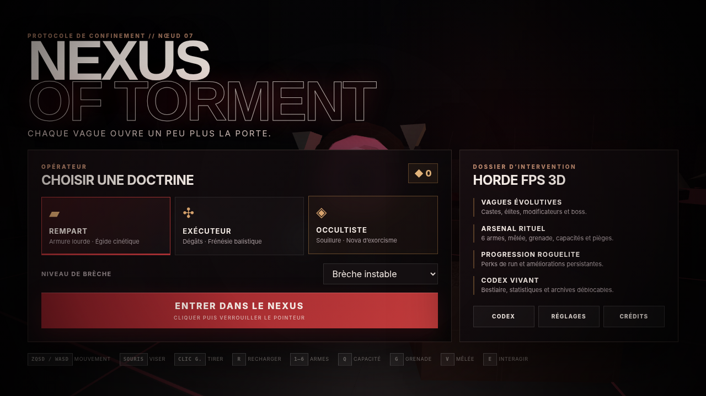
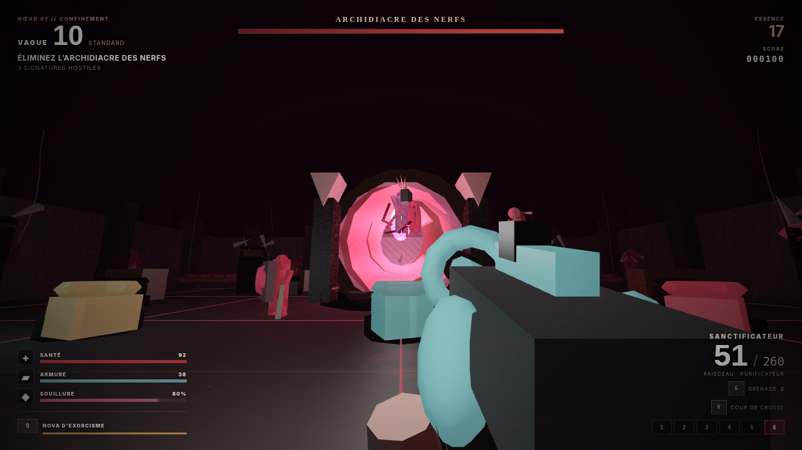

# NEXUS OF TORMENT

**FPS 3D de survie en vagues — édition autonome 1.1.0 « Liturgie nerveuse »**

*Nexus of Torment* est un horde mode horrifique original jouable en solo au clavier et à la souris. Le projet embarque son moteur WebGL 2, ses modèles 3D procéduraux, ses shaders, son audio synthétisé, son interface, sa progression roguelite et sa sauvegarde locale. Aucune bibliothèque, image, musique ou ressource distante n’est nécessaire pendant la partie.



## Lancer le jeu

### Windows

1. Décompressez entièrement l’archive.
2. Double-cliquez sur **`start-game.bat`**.
3. Si Node.js est disponible, le lanceur démarre le serveur local et ouvre le navigateur automatiquement.
4. Sans Node.js, le lanceur ouvre directement `index.html`.

### macOS / Linux

```bash
chmod +x start-game.sh
./start-game.sh
```

Il est aussi possible d’ouvrir directement **`index.html`** dans un navigateur récent compatible WebGL 2.

### Développement et vérification

```bash
npm start
npm test
```

`npm test` enchaîne la vérification syntaxique, l’audit du contenu, 23 tests fonctionnels de gameplay et 5 tests du serveur HTTP. Le serveur choisit le port `8080`, puis essaie automatiquement les ports suivants si celui-ci est occupé.

## Commandes

| Action | Commande |
|---|---|
| Déplacement | `ZQSD` ou `WASD` |
| Regarder | Souris |
| Tirer | Clic gauche |
| Viser | Clic droit |
| Recharger | `R` |
| Changer d’arme | `1` à `6` ou molette |
| Capacité de classe | `Q` |
| Grenade | `G` |
| Coup de crosse | `V` |
| Interagir | `E` |
| Sauter | `Espace` |
| Courir | `Maj` |
| Pause | `Échap` |

Le jeu utilise le verrouillage du pointeur. Cliquez dans la scène après le déploiement lorsque le navigateur le demande.

## Contenu de la build 1.1.0

- **3 doctrines jouables** : Rempart, Exécuteur et Occultiste.
- **6 armes complètes** : WARD-9, Absolution, Spine Ripper, Cloueur Rituel, Vesper et Sanctificateur.
- **Coup de crosse** avec portée, dégâts, recul, étourdissement et animation dédiée.
- **11 castes au total** : 9 castes standards et 2 boss distincts.
- **Boss alternés** : Gardien du Seuil aux vagues 5, 15, 25… et Archidiacre des Nerfs aux vagues 10, 20, 30…
- **4 niveaux de difficulté** avec multiplicateurs de santé, vitesse, pression, Souillure et récompenses.
- **7 modificateurs de vagues** : Extinction, Frénésie, Hémorragie, Pluie de chaînes, Sacrement noir, Silence liturgique et Standard.
- **20 greffes de run** cumulables avec rangs et synergies.
- **6 améliorations persistantes** achetées avec les fragments gagnés.
- **7 stations diégétiques** : surcharge électrique, munitions, purification médicale et quatre armureries.
- Dégâts localisés, tirs à la tête, pénétration, recul, dispersion, chute de dégâts, grenades et arcs électriques.
- IA de meute, contrôle, vol, tir rituel, charge, blindage frontal, soutien, assassinat, corruption et boss multi-phase.
- Particules, traces de tir, impacts, sang procédural optionnel, brouillard, éclairage dynamique et hallucinations de Souillure.
- Audio généré en temps réel avec Web Audio : armes, coups, impacts, entités, alarmes, drones et pulsations.
- Codex, statistiques de carrière, réglages, pause, résultats et sauvegarde locale.



## Nouveautés principales de la 1.1

### Vesper — lance-chaînes

Un projectile lourd qui traverse une cible supplémentaire, applique un ralentissement et attire vers le joueur les créatures non boss. Son faible chargeur oblige à choisir les cibles capables de rompre la formation.

### Sanctificateur — projecteur purificateur

Une arme automatique énergétique dont les dégâts augmentent avec la Souillure de l’Occultiste. Elle inflige une brûlure persistante et reçoit un bonus contre les castes volantes ou psychiques.

### L’Écorché Liturgique

Une avant-garde capable de charger. Son reliquaire frontal absorbe une grande partie des tirs corporels venant de face ; la tête, les flancs et le dos restent vulnérables.

### Archidiacre des Nerfs

Un boss suspendu qui projette de la corruption, condamne plusieurs zones avec des chaînes, ralentit l’opérateur, augmente sa Souillure et invoque de nouvelles castes à 66 % et 33 % de santé.

## Boucle de jeu

1. Choisir une doctrine et un niveau de brèche.
2. Survivre à une vague construite par un budget dynamique.
3. Récupérer de l’Essence et acheter soins, munitions, armes ou surcharge du réseau.
4. Purger les signatures restantes puis sélectionner une greffe parmi trois propositions.
5. Affronter un boss toutes les cinq vagues, avec alternance de comportement et de pression spatiale.
6. Mourir ou poursuivre la tentative, gagner des fragments et améliorer les paramètres de départ.

## Sauvegarde

La progression est enregistrée automatiquement dans le stockage local du navigateur sous la clé :

```text
nexus-of-torment-save-v1
```

La sauvegarde comprend les réglages, fragments, améliorations persistantes, entrées du bestiaire et records de carrière. La 1.1.0 conserve la même structure de sauvegarde que la 1.0.0.

## Architecture

```text
Nexus-of-Torment/
├── index.html                 Écrans, HUD et structure de l’interface
├── styles.css                 Direction UI/UX responsive
├── server.mjs                 Serveur local sans dépendance
├── src/
│   ├── core/
│   │   ├── math.js            Vecteurs, matrices, collisions et utilitaires
│   │   ├── engine.js          WebGL 2, géométries, rendu, particules, entrées, save
│   │   └── audio.js           Synthèse Web Audio
│   └── game/
│       ├── data.js            Arsenal, classes, castes, vagues et greffes
│       ├── arena.js           Arène, collisions, stations et dangers
│       ├── entities.js        Joueur, IA, boss, projectiles et pickups
│       ├── weapons.js         Gunplay, mêlée et modèles de vue FPS
│       ├── ui.js              Menus, HUD, Codex et progression
│       └── game.js            Directeur de partie et boucle principale
├── tools/
│   ├── check.mjs              Validation syntaxique
│   ├── audit.mjs              Audit des ressources et inventaires
│   ├── runtime-smoke.mjs      Tests déterministes des mécaniques
│   └── http-smoke.mjs         Tests du serveur local et de sa sécurité
├── docs/                      GDD, documentation, Codex, QA et roadmap
└── screenshots/               Captures des builds vérifiées
```

## Configuration recommandée

- Ordinateur avec clavier et souris.
- Chrome, Edge ou Firefox récent compatible WebGL 2.
- Accélération matérielle activée.
- Résolution de 1280 × 720 ou supérieure.
- Casque conseillé pour le mixage spatial.

## Résolution des problèmes

**Écran « WebGL 2 requis »** : activez l’accélération matérielle, mettez à jour le pilote graphique et relancez le navigateur.

**La souris reste visible** : cliquez dans le canvas après le lancement et autorisez le verrouillage du pointeur.

**Le son ne démarre pas** : une interaction utilisateur est imposée par les navigateurs ; cliquez sur « Entrer dans le Nexus ».

**Performances faibles** : choisissez le rendu « Performance », activez les flashs réduits et désactivez le gore procédural.

**Le double-clic sur le HTML est refusé par une politique d’entreprise** : lancez `start-game.bat` avec Node.js afin de servir le jeu sur `127.0.0.1`.

## Périmètre

Cette édition est un **FPS WebGL 2 autonome**, et non un projet Unreal Engine ni un exécutable Steam natif. Elle cible le solo de bureau. Le multijoueur réseau, la manette native, plusieurs cartes et la campagne scénarisée restent hors de cette build.

## Identité et droits

Le jeu est une œuvre originale d’horreur industrielle, charnelle et rituelle. Il ne reprend aucun personnage, nom, monstre, dialogue, musique ou asset d’une licence existante. Le code est distribué sous licence MIT ; voir `LICENSE`.

## Avertissement de contenu

Le jeu contient une esthétique d’horreur corporelle, des créatures mutilées stylisées, des effets de sang procéduraux, des flashs lumineux et des sons oppressants. Les options permettent de réduire les flashs et de désactiver le gore.
