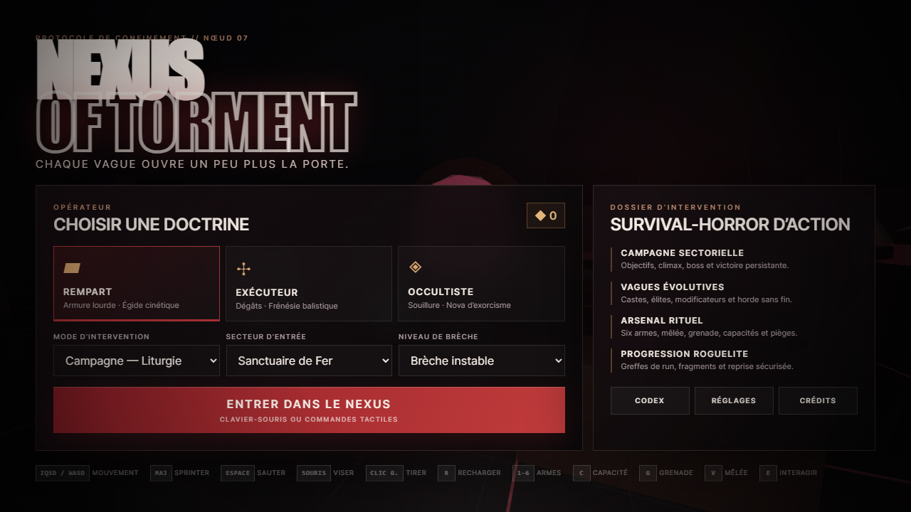
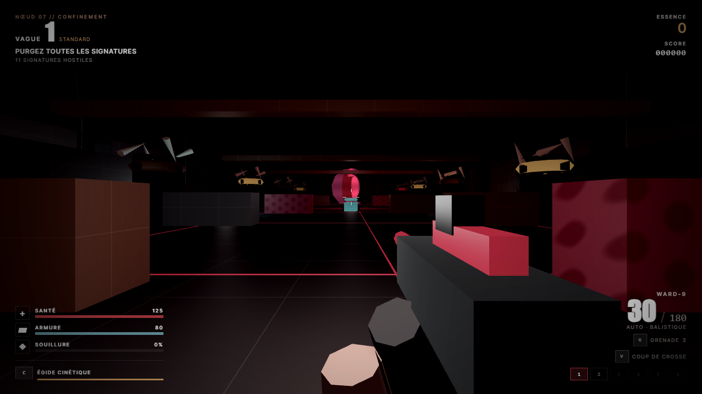
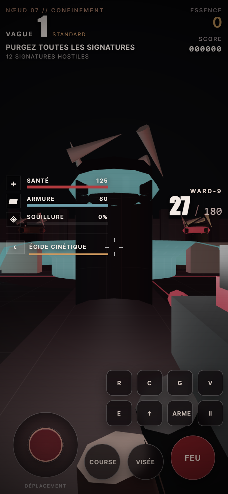

# NEXUS OF TORMENT

**Survival-horror d’action 3D — édition autonome 1.2.0 « Liturgie nerveuse »**

*Nexus of Torment* est un survival-horror d’action original jouable en solo au clavier-souris ou avec ses commandes tactiles. Le projet embarque son moteur WebGL 2, ses modèles 3D procéduraux, ses shaders, son audio synthétisé, son interface, sa progression roguelite et sa sauvegarde locale. La PWA installable reste jouable hors ligne après sa première mise en cache ; aucune bibliothèque, image, musique ou ressource distante n’est nécessaire pendant la partie.



## Lancer le jeu

### Windows

1. Décompressez entièrement l’archive.
2. Double-cliquez sur **`start-game.bat`**.
3. Si Node.js est disponible, le lanceur démarre le serveur local et ouvre le navigateur automatiquement.
4. Sans Node.js, le lanceur ouvre directement `index.html`.

### macOS / Linux

```bash
chmod +x start-game.sh
./start-game.sh
```

Il est aussi possible d’ouvrir directement **`index.html`** dans un navigateur récent compatible WebGL 2.

### Développement et vérification

```bash
npm start
npm ci
npm test
npm run build
npm run qa:release
```

`npm start` ne nécessite aucune dépendance d’exécution. Pour la QA, `npm ci` installe l’outillage verrouillé. `npm test` enchaîne la syntaxe, l’audit statique, les tests déterministes du gameplay et 5 tests HTTP. `npm run qa:release` construit ensuite le jeu, exécute les parcours Chrome desktop/mobile/PWA, puis valide strictement la preuve fraîche. Le serveur choisit le port `8080`, puis essaie automatiquement les ports suivants si celui-ci est occupé.

La QA utilise Chrome installé localement ; `NEXUS_CHROME_PATH` permet de choisir son binaire et `NEXUS_QA_HEADLESS=false` d’afficher la fenêtre. La release exige un rendu matériel à 1280 × 720 natif, une médiane d’au moins 30 FPS et aucun échantillon sous 24 FPS. Une URL passée à `npm run qa:browser -- <URL>` écrit ses preuves séparément dans `.qa/production/`.

## Commandes

| Action | Commande |
|---|---|
| Déplacement | `ZQSD` ou `WASD` |
| Regarder | Souris |
| Tirer | Clic gauche |
| Viser | Clic droit |
| Recharger | `R` |
| Changer d’arme | `1` à `6` ou molette |
| Capacité de classe | `C` |
| Grenade | `G` |
| Coup de crosse | `V` |
| Interagir | `E` |
| Sauter | `Espace` |
| Courir | `Maj` |
| Pause | `Échap` |

Sur desktop, le jeu utilise le verrouillage du pointeur : cliquez dans la scène après le déploiement lorsque le navigateur le demande. Sur écran tactile, les sticks de déplacement et de visée ainsi que les actions de combat apparaissent automatiquement.

## Contenu de la build 1.2.0

- **3 doctrines jouables** : Rempart, Exécuteur et Occultiste.
- **2 modes** : campagne en 10 vagues avec extraction, et survie sans fin.
- **3 secteurs distincts** : Sanctuaire de Fer, Nef des Sutures et Ossuaire des Crochets.
- **3 objectifs de vague** : purge, maintien du sceau et chasse de signatures marquées, complétés par les offices de boss.
- **6 armes complètes** : WARD-9, Absolution, Spine Ripper, Cloueur Rituel, Vesper et Sanctificateur.
- **Coup de crosse** avec portée, dégâts, recul, étourdissement et animation dédiée.
- **11 castes au total** : 9 castes standards et 2 boss distincts.
- **Boss alternés** : Gardien du Seuil aux vagues 5, 15, 25… et Archidiacre des Nerfs aux vagues 10, 20, 30…
- **4 niveaux de difficulté** avec multiplicateurs de santé, vitesse, pression, Souillure et récompenses.
- **7 modificateurs de vagues** : Extinction, Frénésie, Hémorragie, Pluie de chaînes, Sacrement noir, Silence liturgique et Standard.
- **20 greffes de run** cumulables avec rangs et synergies.
- **6 améliorations persistantes** achetées avec les fragments gagnés.
- **7 stations diégétiques par secteur** : surcharge électrique, munitions, purification médicale et quatre armureries.
- Dégâts localisés, tirs à la tête, pénétration, recul, dispersion, chute de dégâts, grenades et arcs électriques.
- IA de meute, contrôle, vol, tir rituel, charge, blindage frontal, soutien, assassinat, corruption et boss multi-phase.
- Particules, traces de tir, impacts, sang procédural optionnel, brouillard, éclairage dynamique et hallucinations de Souillure.
- Audio généré en temps réel avec Web Audio : armes, coups, impacts, entités, alarmes, drones et pulsations.
- Checkpoint inter-vague, reprise validée après rechargement, mort, résultats, victoire puis continuation optionnelle en mode infini.
- Codex, statistiques de carrière, réglages, pause, sauvegarde locale et options d’accessibilité : échelle du HUD, secousses, mouvement réduit, contrastes et sous-titres.
- Interface responsive, commandes tactiles, manifeste installable, service worker et démarrage hors ligne.





## Nouveautés principales de la 1.2

### Campagne et survie sans fin

La campagne « Liturgie nerveuse » impose dix vagues, deux offices de boss puis un maintien dans le sceau d’extraction. La victoire clôt proprement le résultat et permet, au choix, de recommencer, de revenir au dossier ou de prolonger la même tentative en survie sans fin.

### Secteurs et objectifs

Le Sanctuaire de Fer, la Nef des Sutures et l’Ossuaire des Crochets possèdent leurs propres limites, couvertures, piliers, départs, stations, apparitions et ancrages d’objectif. Les vagues alternent purge, maintien d’une zone et chasse de cibles marquées, avec renforts anti-blocage.

### Reprise, mobile et accessibilité

Un checkpoint sécurisé est écrit entre les vagues et restaure la doctrine, la difficulté, le secteur, l’économie et la progression du run. Le même jeu expose des commandes tactiles complètes et des réglages de lisibilité sans désactiver la boucle de combat.

### PWA autonome

Le manifeste et le service worker mettent en cache le cœur statique du jeu. La suite Chrome vérifie l’installation du cache, le redémarrage hors ligne et la réponse contrôlée aux ressources absentes.

## Arsenal et bestiaire consolidés depuis la 1.1

### Vesper — lance-chaînes

Un projectile lourd qui traverse une cible supplémentaire, applique un ralentissement et attire vers le joueur les créatures non boss. Son faible chargeur oblige à choisir les cibles capables de rompre la formation.

### Sanctificateur — projecteur purificateur

Une arme automatique énergétique dont les dégâts augmentent avec la Souillure de l’Occultiste. Elle inflige une brûlure persistante et reçoit un bonus contre les castes volantes ou psychiques.

### L’Écorché Liturgique

Une avant-garde capable de charger. Son reliquaire frontal absorbe une grande partie des tirs corporels venant de face ; la tête, les flancs et le dos restent vulnérables.

### Archidiacre des Nerfs

Un boss suspendu qui projette de la corruption, condamne plusieurs zones avec des chaînes, ralentit l’opérateur, augmente sa Souillure et invoque de nouvelles castes à 66 % et 33 % de santé.

## Boucle de jeu

1. Choisir une doctrine, un mode, un secteur d’entrée et un niveau de brèche.
2. Remplir l’objectif de vague construit par le directeur : purge, maintien ou chasse.
3. Récupérer de l’Essence et acheter soins, munitions, armes ou surcharge du réseau.
4. Choisir une greffe, utiliser l’intermission jouable de 20 secondes ou lancer immédiatement la vague suivante.
5. Affronter le Gardien du Seuil à la vague 5 puis l’Archidiacre des Nerfs à la vague 10.
6. En campagne, tenir le sceau d’extraction pour obtenir la victoire, puis quitter ou continuer en survie infinie.
7. En cas de mort, recevoir le bilan et les fragments ; un abandon ne verse pas de récompense.

## Sauvegarde

La progression est enregistrée automatiquement dans le stockage local du navigateur sous la clé :

```text
nexus-of-torment-save-v1
```

La sauvegarde comprend les réglages, fragments, améliorations persistantes, entrées du bestiaire, records de carrière et checkpoint de tentative active. La clé historique reste compatible ; les données de reprise sont validées et bornées avant restauration.

## Architecture

```text
Nexus-of-Torment/
├── index.html                 Écrans, HUD et structure de l’interface
├── styles.css                 Direction UI/UX responsive
├── manifest.webmanifest       Métadonnées d’installation PWA
├── sw.js                      Cache du cœur statique et fallback hors ligne
├── server.mjs                 Serveur local sans dépendance
├── src/
│   ├── core/
│   │   ├── math.js            Vecteurs, matrices, collisions et utilitaires
│   │   ├── engine.js          WebGL 2, géométries, rendu, particules, entrées, save
│   │   └── audio.js           Synthèse Web Audio
│   └── game/
│       ├── data.js            Arsenal, classes, castes, vagues et greffes
│       ├── arena.js           Secteurs, collisions, stations et dangers
│       ├── entities.js        Joueur, IA, boss, projectiles et pickups
│       ├── weapons.js         Gunplay, mêlée et modèles de vue FPS
│       ├── ui.js              Menus, HUD, Codex et progression
│       └── game.js            Directeur de partie et boucle principale
├── tools/
│   ├── check.mjs              Validation syntaxique
│   ├── audit.mjs              Audit des ressources et inventaires
│   ├── runtime-smoke.mjs      Tests déterministes des mécaniques
│   ├── http-smoke.mjs         Tests du serveur local et de sa sécurité
│   ├── browser-qa.mjs         Parcours Chrome desktop/mobile/hors-ligne
│   └── build.mjs              Production statique dans dist
├── docs/                      GDD, documentation, Codex, QA et roadmap
└── screenshots/               Captures des builds vérifiées
```

## Configuration recommandée

- Ordinateur avec clavier-souris, ou appareil mobile tactile assez récent.
- Chrome, Edge, Firefox ou navigateur mobile récent compatible WebGL 2.
- Accélération matérielle activée.
- Résolution de 1280 × 720 ou supérieure.
- Casque conseillé pour le mixage spatial.

## Résolution des problèmes

**Écran « WebGL 2 requis »** : activez l’accélération matérielle, mettez à jour le pilote graphique et relancez le navigateur.

**La souris reste visible sur desktop** : cliquez dans le canvas après le lancement et autorisez le verrouillage du pointeur.

**Le son ne démarre pas** : une interaction utilisateur est imposée par les navigateurs ; cliquez sur « Entrer dans le Nexus ».

**Performances faibles** : choisissez le rendu « Performance », activez les flashs réduits et désactivez le gore procédural.

**Le double-clic sur le HTML est refusé par une politique d’entreprise** : lancez `start-game.bat` avec Node.js afin de servir le jeu sur `127.0.0.1`.

**Le mode hors ligne n’est pas encore disponible** : ouvrez une première fois la version servie avec une connexion active afin que le service worker termine la mise en cache.

## Périmètre

Cette édition est un **survival-horror WebGL 2 autonome** pour navigateur desktop et mobile. Elle comprend trois secteurs, une campagne complète et un mode infini. Le multijoueur réseau, la manette native, la sauvegarde cloud, le matchmaking, un backend et une boutique en ligne restent hors de cette build.

## Identité et droits

Le jeu est une œuvre originale d’horreur industrielle, charnelle et rituelle. Il ne reprend aucun personnage, nom, monstre, dialogue, musique ou asset d’une licence existante. Le code est distribué sous licence MIT ; voir `LICENSE`.

## Avertissement de contenu

Le jeu contient une esthétique d’horreur corporelle, des créatures mutilées stylisées, des effets de sang procéduraux, des flashs lumineux et des sons oppressants. Les options permettent de réduire les flashs et de désactiver le gore.
