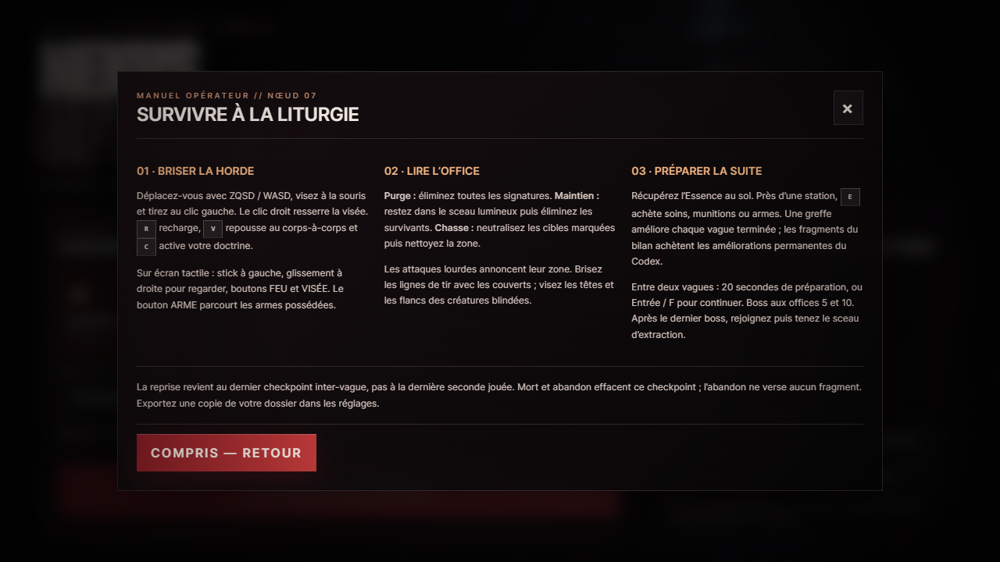
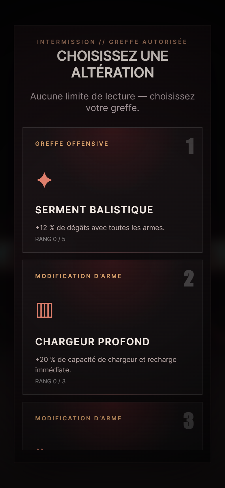
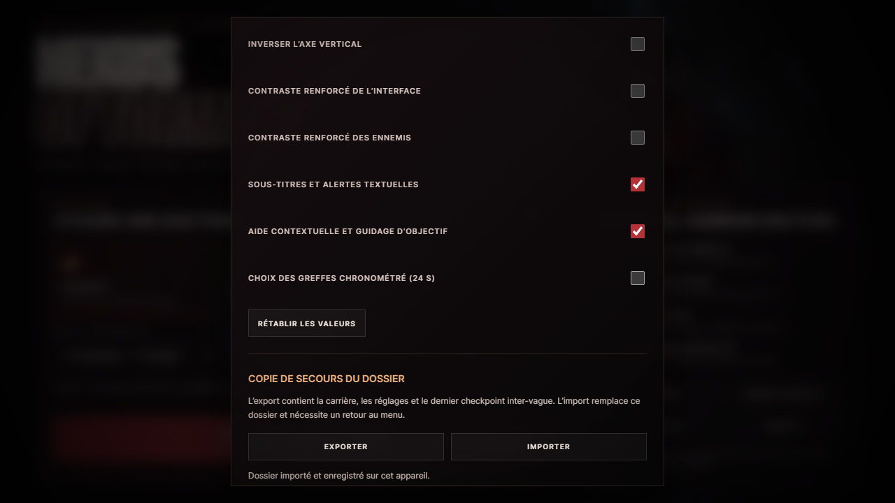

# Audit produit — NEXUS OF TORMENT

31 août 2026 · Édition 1.2.0 « Liturgie nerveuse »

## Conclusion et périmètre

Le jeu conserve son identité d’horreur industrielle, sa géométrie facettée originale et son audio synthétisé. Le périmètre solo comprend une entrée de partie, dix vagues avec objectifs, deux boss, une extraction/victoire, une survie infinie optionnelle, six armes et une progression persistante. Les trois secteurs sont des espaces sélectionnables ; ils ne constituent pas une campagne narrative linéaire à trois chapitres.

L’audit a traité les défauts reproductibles de combat, lisibilité, sauvegarde, commandes et distribution. Les portes techniques locales sont vertes : voir [rapport QA](QA_REPORT.md) et [preuve Chrome horodatée](QA_BROWSER_1.2.json). Cela ne constitue pas une certification commerciale, une homologation de boutique ou un playtest externe.

## Parcours inspecté en cinq étapes

Les captures proviennent de la build locale réelle dans Chrome. Elles ont été inspectées et les parcours exercés ; l’illustration d’écran-titre n’est pas une capture du moteur.

| Étape | État après correction | Ce que la preuve couvre |
|---|---|---|
| 1. Dossier et doctrine | Fonctionnel et lisible | 3 classes, 4 difficultés, 2 modes, 3 secteurs, valeurs et passif expliqués, briefing, menus mobiles accessibles |
| 2. Combat et lecture de l’arène | Contrats renforcés | Têtes réellement touchables, couverture de mêlée, ralentissements, silhouettes stables, contraste ciblé, lumières sectorielles, télégraphe du Gardien |
| 3. Préparation et progression | Fonctionnel | Greffes lisibles sans limite par défaut, chrono optionnel, stations, choix tactile de la prochaine vague, indications vers l’objectif |
| 4. Interruption, mort et reprise | Fonctionnel et protégé | Annuler un abandon/redémarrage, mort/victoire distinctes, export/import, refus d’écriture, corruption de dossier, perte audio/WebGL/focus |
| 5. Distribution et hors-ligne | Validé localement | Build reproductible, ressources originales embarquées, cache cohérent, redirection de navigation, démarrage serveur coupé |

### 1. Dossier et briefing

Le menu utilise la direction visuelle existante. Les problèmes constatés étaient l’absence de règles consultables, des réglages/Codex masqués par le CSS mobile et une typographie de titre qui se chevauchait. Le briefing couvre les commandes, objectifs, stations, boss et limites du checkpoint. Les informations restent disponibles depuis la pause.

### 2. Combat

Les corrections ne remplacent pas les modèles par l’illustration OpenAI. La direction artistique reste volontairement low-poly. Les points faibles, télégraphes et sources lumineuses sont raccordés aux vraies coordonnées et règles de dégâts.

### 3. Préparation et lecture mobile

Les chevauchements entre statistiques, objectif et commandes du paysage ont été corrigés après capture. Le menu portrait reste défilable. Les boutons de combat et les parcours testés sont utilisables au tactile ; aucune vérification sur appareil physique n’est revendiquée.

### 4. Dossier de secours

L’import demande confirmation, se limite au menu, refuse les identifiants hérités et versions inconnues, puis ne remplace la mémoire qu’après persistance réussie. Le focus revient à l’action d’origine lors d’une annulation. Les écritures non confirmées restent signalées, avec export possible.

## Défauts prioritaires traités

| Priorité | Défaut observé ou reproduit | Correction et preuve |
|---|---|---|
| P0 | `records:null` peut faire échouer la finalisation | Schéma de sauvegarde typé/borné, réparation avec copie, régression VM et Chrome |
| P0 | AudioContext indisponible bloque le démarrage | Initialisation non fatale et mode silencieux ; vrai démarrage Chrome avec constructeur refusé |
| P1 | Reprise PWA en échec sous redirection Vercel | Réponse HTML redirigée reconstruite ; échec `ERR_FAILED` reproduit puis parcours complet rétabli |
| P1 | Import de valeurs `constructor` produit des statistiques invalides | Vérification de propriété propre pour les identifiants et états ; imports rejetés sans mutation |
| P1 | Têtes visibles intouchables selon caste | Raycast sur volumes/transformations réellement dessinés, dont les têtes mobiles du Chœur |
| P1 | Coups de mêlée à travers un coin de couvert | Test de ligne bloquée entre deux positions valides ; dégâts empêchés |
| P1 | Entrave expirée réutilise une ancienne intensité | Nettoyage de la valeur à l’expiration chez le joueur et les ennemis |
| P1 | Animation grossit à chaque image | Échelle de base conservée et pose reconstruite ; répétition identique et dix minutes simulées sans dérive |
| P1 | Audio/jeu continuent après perte de focus tactile | Pause, libération des touches virtuelles et suspension audio |
| P1 | Restauration WebGL masque un rendu irrécupérable | Simulation/rendu figés, checkpoint intact, rechargement explicite testé avec perte GPU réelle |
| P1 | Risque de modules PWA de deux versions différentes | Shell atomique par empreinte de build, pas de prise de contrôle forcée des anciens onglets |
| P1 | Perte de carrière après import ou achat non persistant | Transaction d’import et rollback d’achat, statut visible |
| P2 | Contraste ennemi appliqué à toute l’image | Matériaux ciblés, points faibles distincts, retour exact aux matériaux normaux |
| P2 | Réduction des flashes incomplète | Muzzle flash atténué et suppression du flash blanc plein corps |
| P2 | Éclairage et slam peu cohérents avec le secteur/rayon | Trois lumières propres à chaque secteur dans le budget de quatre, cercle d’impact préalable exact |
| P2 | Interruption accidentelle ou information insuffisante | Confirmations, briefing, guidage, greffes sans chrono et export du dossier |
| P2 | Écran-titre sans illustration dédiée | Création originale OpenAI embarquée et précachée, [provenance et prompt](ASSET_PROVENANCE.md) |

## Équilibrage et longévité

La campagne se conclut réellement et la survie infinie réutilise proprement l’arsenal et les améliorations. Les douze campagnes déterministes couvrent les transitions, pas une victoire sans assistance.

L’[analyse économique](BALANCE_AUDIT.md) exécute 640 variantes : les profils à partir de 25 % d’impacts corporels sont financés sous les hypothèses déclarées ; les profils très imprécis rencontrent surtout une contrainte au premier boss. Les ressources n’ont pas été gonflées arbitrairement d’après ce seul modèle. Navigation en combat, choix réels, dégâts reçus, plaisir et tension prolongée demandent un playtest humain distinct.

## Limites explicites de cette livraison

- Chrome avec GPU matériel local et émulation mobile portrait/paysage ; pas Safari ni parc de téléphones physiques.
- Audio synthétisé et bus compressé vérifiés au niveau des contrats ; pas de mesure de confort au casque ni certification de niveau sonore.
- Options de mouvement, flash, contraste, focus et lecture ; pas de certification WCAG, console ou d’innocuité face à l’épilepsie.
- Pas de multijoueur, de manette native ou de sauvegarde cloud dans cette édition solo.
- Pas de promesse « zéro bug », de taux de victoire, de durée de campagne ou de qualité AAA à partir de tests automatisés.

La publication exige ensuite CI verte, push sélectif, Vercel Ready, empreintes HTTP des fichiers de production et reprise des parcours Chrome sur l’URL publique. Les preuves de production sont séparées de l’audit local.
