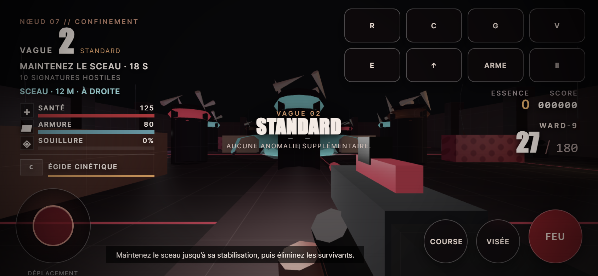

# Rapport QA — 1.2.1 « Liturgie nerveuse »

Date : 31 août 2026. Périmètre : jeu solo WebGL 2, Chrome desktop et tactile émulé.

## Résultats locaux

La commande de publication est `npm run qa:release`. Les preuves actives se trouvent dans [QA_BROWSER_1.2.json](QA_BROWSER_1.2.json), et les scénarios restent reproductibles dans `tools/`.

| Suite | Résultat |
|---|---:|
| Scripts de jeu : syntaxe | 10/10 |
| Audit statique | 95/95 |
| Gameplay historique, inchangé | 72/72 |
| Combat, accessibilité ennemie et progression | 41/41 |
| Animation sans dérive | 33/33 |
| Lumières, télégraphes et flashes | 27/27 |
| Sauvegarde, audio, cycle de vie et PWA | 73/73 |
| Interface et transactions | 44/44 |
| Commandes et entrées physiques/tactiles | 87/87 |
| Stockage concurrent, versions futures et intégrité PWA | 51/51 |
| Charges, slam, stations et orientation de reprise | 33/33 |
| Serveur HTTP local | 5/5 |
| Build et intégrité de révision | 9/9 |
| Chrome réel, parcours desktop/mobile/PWA | 97/97 |
| Audit final de la preuve navigateur | 103/103 |

Les neuf suites comportementales totalisent **461 contrôles**. Certains regroupent plusieurs variantes ; ils ne représentent pas 461 parties jouées. Les audits statiques et de release sont séparés : leurs assertions se recoupent.

## Ce qui est réellement testé

### Gameplay et combat

Le vrai code est chargé dans une VM avec un service de rendu simulé. Les tests préexistants restent inchangés. Les nouvelles régressions reproduisent les têtes intouchables de plusieurs castes, l’entrave résiduelle et la mêlée à travers un couvert, puis vérifient les corrections. Les onze castes et variantes élites gardent une animation bornée, des matériaux réversibles et leurs silhouettes de base. Le cercle du Gardien apparaît avant l’impact, au rayon exact des dégâts.

Douze campagnes couvrent trois secteurs et quatre difficultés : dix vagues, objectifs, deux boss, greffes, stations, checkpoint, extraction et victoire. Les éliminations et déplacements d’objectif sont injectés : ces scénarios prouvent les contrats du directeur, pas une campagne gagnée par un joueur ni une mesure de difficulté.

### Sauvegarde et récupération

La passe 1.2.1 reproduit aussi une écriture depuis un onglet périmé : deux pages Chrome partagent une base de 19 fragments, la première en enregistre 21, la seconde reçoit le vrai événement storage et bloque ses écritures sans écraser les 21 fragments. Son brouillon reste exportable octet pour octet, puis le rechargement confirmé adopte la nouvelle base. Une sauvegarde de version 999 conserve son brut, ses CRLF, son Unicode et son secours préexistant ; le démarrage et l’import restent interdits dans l’ancienne application.

Le garde compare la dernière valeur lue juste avant l’écriture. Il détecte un état périmé ; localStorage ne fournit pas de transaction atomique entre processus. Un seul onglet de jeu actif reste conseillé. Ce n’est pas une sauvegarde cloud.

Les tests emploient le vrai `SaveStore` : sous-objets invalides, JSON corrompu, champs bornés, version future, identifiants hérités (`constructor`, `toString`, `__proto__`), import/export, reprise et refus d’écriture. L’import ne remplace jamais le dossier en mémoire si la persistance échoue. Les achats échoués rendent les fragments et le rang.

Dans Chrome, un stockage corrompu est réparé avec copie de secours et avertissement visible. Une construction d’AudioContext volontairement refusée n’empêche pas de jouer. L’extension WebGL réelle provoque une perte puis une restauration du contexte : simulation figée, bouton de rechargement conservé, checkpoint intact puis reprise proposée après reconstruction.

### Interface et mobile

Les vingt actions clavier/souris sont accessibles depuis les réglages. Chrome vérifie le conflit R/grenade, l’annulation, l’enregistrement de I/T, leur restauration après reload, le vrai déplacement avec I, l’absence de déplacement avec l’ancien W et le retour aux valeurs par défaut via confirmation UI. La mesure du déplacement isole temporairement impulsions et dégâts ; hordes et directeur restent présents. Le dialogue mobile est défilable et ses vingt cibles font au moins 44 pixels CSS.

Menus, briefing, réglages, export téléchargé, import confirmé/annulé/refusé, focus, confirmation d’abandon/redémarrage, nouveau run et reprise passent par leurs contrôles visibles. Les greffes n’ont plus de délai par défaut ; le chrono est optionnel et suspendu quand l’onglet est caché.

Le tactile est exercé en Chrome à **390 × 844**, puis **844 × 390** : menus secondaires accessibles, tir réellement transmis au système d’arme, stick, pause, greffe, lancement manuel de l’intermission, guidage et perte de focus. Les boutons testés mesurent au moins 44 pixels CSS. Le HUD paysage a été corrigé après inspection des captures réelles.

### PWA et réseau

La build contient les SHA-256 SRI attendus pour chaque ressource précachée. Chrome retire deux fichiers de son cache QA, puis vérifie la réparation complète des 17 entrées. Une interception isolée altère ensuite réellement un module distant : Fetch refuse son intégrité, le lot reste incomplet sans écriture partielle et renvoie 503. Après retrait de l’interception et délai anti-boucle, le shell se répare. Ces opérations touchent seulement un profil de test temporaire.

Le statut hors ligne/installable/installé est distinct dans les réglages. Le dialogue natif d’installation n’a pas été validé par une installation humaine sur appareil ; ses événements sont couverts par des contrats. Une erreur technique reste dans les diagnostics, jamais dans le texte joueur.

Le serveur de QA reproduit la redirection Vercel `/index.html → /`. Cela a révélé un vrai `net::ERR_FAILED` lors de la reprise : la réponse HTML redirigée était mise en cache. Le service worker reconstruit désormais cette réponse sans perdre son contenu ni ses en-têtes.

La QA coupe réellement le serveur, recharge la PWA, vérifie WebGL puis un cache-miss contrôlé en 503. Tous les modules connus proviennent de la même révision installée. Le nouveau worker ne prend pas le contrôle des anciens onglets de force ; il faut fermer les onglets du jeu pour appliquer sa mise à jour.

Pour une URL de production, Playwright 1.55 nécessite l’activation de son inspection réseau des service workers pour que `setOffline(true)` les déconnecte aussi. Le banc active cette option uniquement dans son processus, puis exige qu’un fetch direct du worker, sans cache HTTP, échoue avant le redémarrage hors ligne. Un 404 réellement obtenu de Vercel ne peut donc plus être confondu avec une coupure réseau. Le jeu et le réseau de la machine ne sont pas modifiés par ce réglage de test.

### Build

Dix-huit fichiers statiques, dont l’illustration originale, sont publiés. Les textes sont normalisés en LF ; les binaires restent intacts. L’empreinte SHA-256 du shell inclut chemins, longueurs, contenu et SW source, puis est injectée dans le nom du cache de `dist/sw.js`. Le SW source n’est pas modifié. Deux builds identiques et l’invalidation de révision après changement sont vérifiés.

## Console et performances

Aucune erreur inattendue n’est admise. Les signaux explicitement provoqués sont archivés à part : 503 hors ligne, refus SRI dans le profil de réparation et message exact de perte WebGL volontaire. Les erreurs d’audio ou de pointeur ne sont pas ignorées par une expression générale.

Les mesures exactes de cadence, GPU, date et empreinte de build sont dans le rapport JSON. La porte matérielle locale exige **1280 × 720 natif**, renderScale 1, trois échantillons ≥24 FPS et médiane ≥30 FPS. Il s’agit d’un scénario court sur Radeon RX 6800 XT, pas d’un benchmark toutes hordes/tous appareils.

La CI Linux utilise explicitement SwANGLE logiciel pour les parcours fonctionnels. Son seuil de cadence adapté ne remplace pas la preuve GPU locale.

## Captures inspectées

Autres captures : menu mobile, combat portrait, briefing, outils de sauvegarde et choix de greffes dans `docs/screenshots/`.

La passe 1.2.1 ajoute les commandes desktop/mobile et les dossiers protégés : `v1.2-bindings.png`, `v1.2-mobile-bindings.png`, `v1.2-storage-conflict.png`, `v1.2-future-save.png`. Les noms de preuves restent dans la famille 1.2 ; le JSON précise la version exacte et son empreinte de build.

L’inspection du paysage a révélé une fausse alerte « dossier réparé ». Le parcours Chrome complet a isolé un seul champ : un yaw de 0,00022822839394567797 devenait 0,00022822839394567794. La normalisation conserve désormais les angles canoniques exactement et intervient dès la création du snapshot. Le contrôle navigateur exige une sauvegarde valide sans réparation ; la capture finale confirme la disparition de l’alerte.

Le navigateur intégré Codex était indisponible par restriction ACL. Les parcours ont été exécutés par le SDK de la suite du dépôt dans Google Chrome réel headless, puis les captures locales ont été inspectées. Aucun playtest humain n’est sous-entendu.

## Équilibrage : preuve distincte

Les quatre correctifs de gameplay 1.2.1, leurs références et limites sont détaillés dans [GAMEPLAY_POLISH_1.2.1.md](GAMEPLAY_POLISH_1.2.1.md). Le noyau de 30 contrats passe 30/30 contre 16/30 sur la référence précédente ; trois régressions supplémentaires couvrent la précision des angles et le vrai SaveStore. Les tests de vague 9995 instancient le vrai boss et exécutent son impact, sans prétendre simuler 9995 vagues complètes.

[Audit analytique du budget](BALANCE_AUDIT.md) : 640 scénarios de tir/achat modélisés. Les 384 scénarios à 25 % / 50 % d’impacts corporels ou 65 % de tirs à la tête sont financés dans les hypothèses déclarées. À faible précision, le premier boss est le principal point de risque.

Ce modèle n’est pas un playtest : il exclut notamment les dégâts reçus en navigation réelle et plusieurs synergies. Il ne justifie pas une promesse de durée, de taux de victoire ou d’absence totale de panne sèche.

## Limites et publication

Le périmètre livré est un jeu solo d’arènes : campagne à dix vagues et extraction, mode sans fin, trois secteurs sélectionnables, six armes, onze castes dont deux boss, progression persistante et sauvegarde locale. Il ne comprend pas réseau multijoueur, manette native, cloud save ni backend de boutique.

Pas de téléphone physique, Safari, test utilisateur externe, session humaine complète ni certification console/store/accessibilité/épilepsie effectués. La création OpenAI est une illustration du dossier, jamais une capture promotionnelle présentée comme gameplay. Ces limites ne doivent pas être masquées par le terme « commercial ».

La production est vérifiée séparément après déploiement avec `npm run qa:production` : octets des 18 fichiers comparés à `dist`, MIME, sécurité HTTP, 404 et nouvelle passe Chrome. Les résultats sont écrits dans `.qa/production/` sans remplacer les preuves locales. Ce rapport local ne présume pas le succès d’un déploiement futur.
